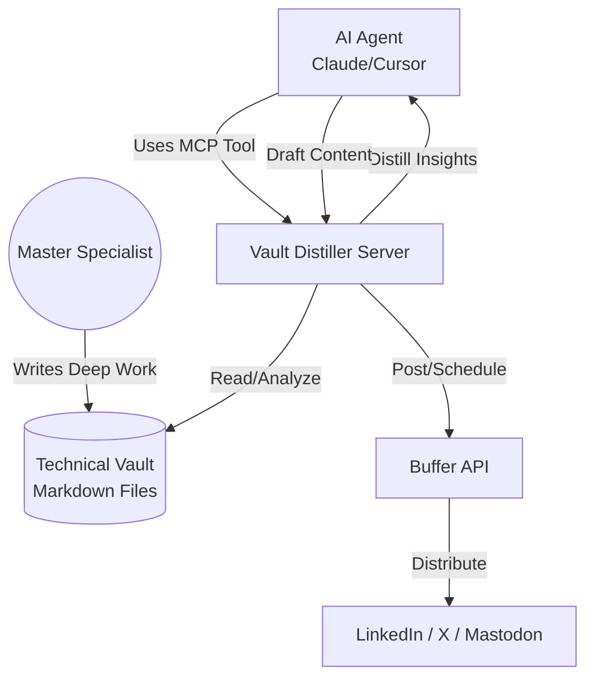

# 🧪 The Forensic Vault Distiller (MCP Server)

[](https://modelcontextprotocol.io)
[](https://opensource.org/licenses/MIT)
[](https://www.python.org/downloads/)

**The Forensic Vault Distiller** is a professional-grade [Model Context Protocol (MCP)](https://modelcontextprotocol.io) server designed to bridge the gap between high-fidelity technical documentation (the "Vault") and professional social presence via the **Buffer API**.

Developed by a "Technical Sentinel," this tool empowers specialists to automate the distillation of deep-work logs into high-signal social content, ensuring technical mastery remains visible without sacrificing deep-work time.

---

## 🏗️ Architectural Overview



---

## 🚀 Why This Matters

In modern GTM and Engineering roles, the **"Specialist's Dilemma"** is real: spend time doing the work, or spend time talking about the work. 

This server solves that by allowing an AI agent to:
1.  **Contextualize:** Access a local "Forensic Vault" of project post-mortems and technical docs.
2.  **Extract:** Identify "Forensic Evidence" of mastery (specific metrics, hurdles overcome, architectural decisions).
3.  **Automate:** Directly schedule high-fidelity updates to social platforms via Buffer, maintaining a consistent professional brand autonomously.

---

## 🛠️ Features

- **Vault Context Tool:** Seamlessly search and read through local markdown documentation.
- **Buffer Integration:** Native MCP tools for `list_profiles`, `create_update`, and `get_sent_updates`.
- **Forensic Tone Control:** Prompts designed to maintain a "Master Specialist" voice—avoiding generic AI fluff.
- **Agentic Memory:** Integrated patterns for agents to "remember" previous technical context across sessions.

---

## 🔧 Installation & Setup

### Prerequisites
- Python 3.10 or higher
- A Buffer Account and [Access Token](https://buffer.com/developers)

### Quick Start
1. **Clone the Repository:**
   ```bash
   git clone https://github.com/magcargoj/vault-distiller-mcp.git
   cd vault-distiller-mcp
   ```

2. **Install Dependencies:**
   ```bash
   pip install -r requirements.txt
   ```

3. **Configure Environment:**
   Create a `.env` file in the root directory:
   ```env
   BUFFER_ACCESS_TOKEN=your_token_here
   VAULT_PATH=./vault
   ```

4. **Run the Server:**
   ```bash
   python server.py
   ```

---

## 🤝 Strategic Partnership
The Forensic Vault Distiller is proud to be a **Strategic Launch Partner** for the Buffer API GA 2026. 

If you find this tool helpful, consider supporting the project by signing up for Buffer via our **[Partner Link](https://join.buffer.com/jeremy-wood)**.

---

## 📜 License
Distributed under the MIT License. See `LICENSE` for more information.

---
**Maintained by [Jeremy Wood](https://jeremywood.digital)**  
*Technical Sentinel | GTM Systems Architect*
